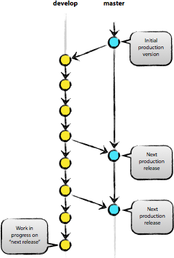
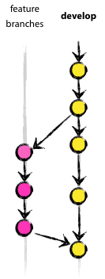
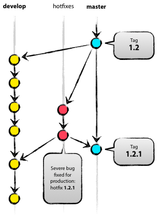

# git-flow
gitflow model (russian)

# Удачная модель ветвления для Git 

*Перевод статьи Vincent Driessen: [A successful Git branching model](http://nvie.com/posts/a-successful-git-branching-model/)*

В этой статье я представляю модель разработки, которую использую для всех моих проектов (как рабочих, так и частных) уже в течение года, и которая показала себя с хорошей стороны. Я давно собирался написать о ней, но до сих пор не находил свободного времени. Не буду рассказывать обо всех деталях проекта, коснусь лишь стратегии ветвления и управления релизами.  
  
  
  
В качестве инструмента управления версиями всего исходного кода она использует [Git](http://git-scm.com/).

## Почему Git?

За полноценным обсуждением всех достоинств и недостатков Git в сравнении с централизованными системами контроля версий [обращайтесь](http://whygitisbetterthanx.com/) [к всемирной](http://www.looble.com/git-vs-svn-which-is-better/) [сети](http://git.or.cz/gitwiki/GitSvnComparsion). Там Вы найдёте достаточное количество споров на эту тему. Лично же я, как разработчик, на данный момент предпочитаю Git всем остальным инструментам. Git реально смог изменить отношение разработчиков к процессам слияния и ветвления. В классическом мире CVS/Subversion, из которого я пришёл, ветвление и слияние обычно считаются опасными («опасайтесь конфликтов слияния, они больно кусаются\!»), и потому проводятся как можно реже.  
  
Но с Git эти действия становятся исключительно простыми и дешёвыми, и потому на деле они становятся центральными элементами обычного *ежедневного* рабочего процесса. Просто сравните: в [книгах](http://svnbook.red-bean.com/) по CVS/Subversion ветвление и слияние обычно рассматриваются в последних главах (для продвинутых пользователей), в то время как в [любой](http://book.git-scm.com/) [книге](http://pragprog.com/titles/tsgit/pragmatic-version-control-using-git) [про Git](http://github.com/progit/progit) они бывают упомянуты уже к третьей главе (основы).  
  
Благодаря своей простоте и предсказуемости, ветвление и слияние больше не являются действиями, которых стоит опасаться. Теперь инструменты управления версиями способны помочь в ветвлении и слиянии больше, чем какие-либо другие.  
  
Но хватит говорить об инструментах, давайте перейдём к модели разработки. Модель, которую я хочу представить, — это, по сути, просто набор процедур, которые исполняет каждый член команды, чтобы все вместе могли достичь высокой управляемости процесса разработки.

## Децентрализованный, но централизованный

Предлагаемая модель ветвления опирается на конфигурацию проекта, содержащую один центральный «истинный» репозиторий. Замечу, что этот репозиторий только *считается* центральным (так как Git является DVCS, у него нет такой вещи, как главный репозиторий, на техническом уровне). Мы будем называть этот репозиторий термином origin, т.к. это имя и так знакомо всем пользователям Git.  
  
  
  
Каждый разработчик забирает и публикует изменения (pull & push) в origin. Но, помимо централизованных отношений push-pull, каждый разработчик также может забирать изменения от остальных коллег внутри своей микро-команды. Например, этот способ может быть удобен в ситуации, когда двое или более разработчиков работают вместе над большой новой фичей, но не могут издать незавершённую работу в origin раньше времени. На картинке выше изображены подгруппы Алисы и Боба, Алисы и Дэвида, Клэр и Дэвида.  
  
Технически это реализуется несложно: Алиса создаёт удалённую ветку Git под названием bob, которая указывает на репозиторий Боба, а Боб делает то же самое с её репозиторием.

Главные ветви

  
Ядро модели разработки не отличается от большинства существующих моделей. Центральный репозиторий содержит две главные ветки, существующие всё время.

  - > master

  - > develop

Ветвь master создаётся при инициализации репозитория, что должно быть знакомо каждому пользователю Git. Параллельно ей также мы создаём ветку для разработки под названием develop.  
  
Мы считаем ветку origin/master главной. То есть, исходный код в ней должен находиться в состоянии *production-ready* в любой произвольный момент времени.  
  
Ветвь origin/develop мы считаем главной ветвью для разработки. Хранящийся в ней код в любой момент времени должен содержать самые последние изданные изменения, необходимые для следующего релиза. Эту ветку также можно назвать «интеграционной». Она служит источником для сборки автоматических ночных билдов.  
  
Когда исходный код в ветви разработки (develop) достигает стабильного состояния и готов к релизу, все изменения должны быть определённым способом влиты в главную ветвь (master) и помечены тегом с номером релиза. Ниже мы рассмотрим этот процесс в деталях.  
  
Следовательно, каждый раз, когда изменения вливаются в главную ветвь (master), мы *по определению* получаем новый релиз. Мы стараемся относиться к этому правилу очень строго, так что, в принципе, мы могли бы использовать хуки Git, чтобы автоматически собирать наши продукты и выкладывать их на рабочие сервера при каждом коммите в главную ветвь (master).

Вспомогательные ветви

Помимо главных ветвей master и develop, наша модель разработки содержит некоторое количество типов вспомогательных ветвей, которые используются для распараллеливания разработки между членами команды, для упрощения внедрения нового функционала (features), для подготовки релизов и для быстрого исправления проблем в производственной версии приложения. В отличие от главный ветвей, эти ветви всегда имеют ограниченный срок жизни. Каждая из них в конечном итоге рано или поздно удаляется.  
  
Мы используем следующие типы ветвей:

  - > Ветви функциональностей (Feature branches)

  - > Ветви релизов (Release branches)

  - > Ветви исправлений (Hotfix branches)

У каждого типа ветвей есть своё специфическое назначение и строгий набор правил, от каких ветвей они могут порождаться, и в какие должны вливаться. Сейчас мы рассмотрим их по очереди.  
  
Конечно же, с технической точки зрения, у этих ветвей нет ничего «специфического». Разбиение ветвей на категории существует только с точки зрения того, как они используются. А во всём остальном это старые добрые ветви Git.

Ветви функциональностей (feature branches)

  
Могут порождаться от: develop  
Должны вливаться в: develop  
Соглашение о наименовании: всё, за исключением master, develop, release-\* или hotfix-\*  
  
Ветви функциональностей (feature branches), также называемые иногда тематическими ветвями (topic branches), используются для разработки новых функций, которые должны появиться в текущем или будущем релизах. При начале работы над функциональностью (фичей) может быть ещё неизвестно, в какой именно релиз она будет добавлена. Смысл существования ветви функциональности (feature branch) состоит в том, что она живёт так долго, сколько продолжается разработка данной функциональности (фичи). Когда работа в ветви завершена, последняя вливается обратно в главную ветвь разработки (что означает, что функциональность будет добавлена в грядущий релиз) или же удаляется (в случае неудачного эксперимента).  
  
Ветви функциональностей (feature branches) обычно существуют в репозиториях разработчиков, но не в главном репозитории (origin).

Создание ветви функциональности (feature branch)

При начале работы над новой функциональностью делается ответвление от ветви разработки (develop).  
  
$ git checkout -b myfeature develop  
Switched to a new branch "myfeature"

Добавление завершённой функциональности в develop

Завершённая функциональность (фича) вливается обратно в ветвь разработки (develop) и попадает в следующий релиз.  
  
$ git checkout develop  
Switched to branch 'develop'  
$ git merge --no-ff myfeature  
Updating ea1b82a..05e9557  
(Отчёт об изменениях)  
$ git branch -d myfeature  
Deleted branch myfeature (was 05e9557).  
$ git push origin develop  
  
Флаг --no-ff вынуждает Git всегда создавать новый объект коммита при слиянии, даже если слияние может быть осуществлено алгоритмом fast-forward. Это позволяет не терять информацию о том, что ветка существовала, и группирует вместе все внесённые изменения. Сравните:  
  
  
  
Во втором случае невозможно увидеть в истории изменений, какие именно объекты коммитов совместно образуют функциональность, — для этого придётся вручную читать все сообщения в коммитах. Отменить функциональность целиком (т.е., группу коммитов) в таком случае невозможно без головной боли, а с флагом --no-ff это делается элементарно.  
  
Конечно, такой подход создаёт некоторое дополнительное количество (пустых) объектов коммитов, но получаемая выгода более чем оправдывает подобную цену.  
  
К сожалению, я ещё не нашёл, как можно настроить Git так, чтобы --no-ff было поведением по-умолчанию при слияниях. Но этот способ должен быть реализован.

Ветви релизов (release branches)

Могут порождаться от: develop  
Должны вливаться в: develop и master  
Соглашение о наименовании: release-\*  
  
Ветви релизов (release branches) используются для подготовки к выпуску новых версий продукта. Они позволяют расставить финальные точки над i перед выпуском новой версии. Кроме того, в них можно добавлять минорные исправления, а также подготавливать метаданные для очередного релиза (номер версии, дата сборки и т.д.). Когда вся эта работа выносится в ветвь релизов, главная ветвь разработки (develop) очищается для добавления последующих фич (которые войдут в следующий большой релиз).  
  
Новую ветку релиза (release branch) надо порождать в тот момент, когда состояние ветви разработки полностью или почти полностью соответствует требованиям, соответствующим новому релизу. По крайней мере, вся необходимая функциональность, предназначенная к этому релизу, уже влита в ветвь разработки (develop). Функциональность, предназначенная к следующим релизам, может быть и не влита. Даже лучше, если ветки для этих функциональностей подождут, пока текущая ветвь релиза не отпочкуется от ветви разработки (develop).  
  
Очередной релиз получает свой номер версии только в тот момент, когда для него создаётся новая ветвь, но ни в коем случае не раньше. Вплоть до этого момента ветвь разработки содержит изменения для «нового релиза», но пока ветка релиза не отделилась, точно неизвестно, будет ли этот релиз иметь версию 0.3, или 1.0, или какую-то другую. Решение принимается при создании новой ветви релиза и зависит от принятых на проекте правил нумерации версий проекта.

Создание ветви релиза (release branch)

Ветвь релиза создаётся из ветви разработки (develop). Пускай, например, текущий изданный релиз имеет версию 1.1.5, а на подходе новый большой релиз, полный изменений. Ветвь разработки (develop) готова к «следующему релизу», и мы решаем, что этот релиз будет иметь версию 1.2 (а не 1.1.6 или 2.0). В таком случае мы создаём новую ветвь и даём ей имя, соответствующее новой версии проекта:  
  
$ git checkout -b release-1.2 develop  
Switched to a new branch "release-1.2"  
$ ./bump-version.sh 1.2  
Files modified successfully, version bumped to 1.2.  
$ git commit -a -m "Bumped version number to 1.2"  
\[release-1.2 74d9424\] Bumped version number to 1.2  
1 files changed, 1 insertions(+), 1 deletions(-)  
  
Мы создали новую ветку, переключились в неё, а затем выставили номер версии (bump version number). В нашем примере bump-version.sh — это вымышленный скрипт, который изменяет некоторые файлы в рабочей копии, записывая в них новую версию. (Разумеется, эти изменения можно внести и вручную; я просто обращаю Ваше внимание на то, что *некоторые* файлы изменяются.) Затем мы делаем коммит с указанием новой версии проекта.  
  
Эта новая ветвь может существовать ещё некоторое время, до тех пор, пока новый релиз окончательно не будет готов к выпуску. В течение этого времени к этой ветви (а не к develop) могут быть добавлены исправления найденных багов. Но добавление крупных новых изменений в эту ветвь строго запрещено. Они всегда должны вливаться в ветвь разработки (develop) и ждать следующего большого релиза.

Закрытие ветви релиза

Когда мы решаем, что ветвь релиза (release branch) окончательно готова для выпуска, нужно проделать несколько действий. В первую очередь ветвь релиза вливается в главную ветвь (напоминаю, каждый коммит в master — это *по определению* новый релиз). Далее, этот коммит в master должен быть помечен тегом, чтобы в дальнейшем можно было легко обратиться к любой существовавшей версии продукта. И наконец, изменения, сделанные в ветви релиза (release branch), должны быть добавлены обратно в разработку (ветвь develop), чтобы будущие релизы также содержали внесённые исправления багов.  
  
Первые два шага в Git:  
  
$ git checkout master  
Switched to branch 'master'  
$ git merge --no-ff release-1.2  
Merge made by recursive.  
(Отчёт об изменениях)  
$ git tag -a 1.2  
  
Теперь релиз издан и помечен тегом.  
  
**Замечание**: при желании, Вы также можете использовать флаги -s или -u \<ключ\>, чтобы криптографически подписать тег.  
  
Чтобы сохранить изменения и в последующих релизах, мы должны влить эти изменения обратно в разработку. Делаем это так:  
  
$ git checkout develop  
Switched to branch 'develop'  
$ git merge --no-ff release-1.2  
Merge made by recursive.  
(Отчёт об изменениях)  
  
Этот шаг, в принципе, может привести к конфликту слияния (нередко бывает, что к причиной конфликта является изменение номера версии проекта). Если это произошло, исправьте их и издайте коммит.  
  
Теперь мы окончательно разделались с веткой релиза. Можно её удалять, потому что она нам больше не понадобится:  
  
$ git branch -d release-1.2  
Deleted branch release-1.2 (was ff452fe).

Ветви исправлений (hotfix branches)

  
Могут порождаться от: master  
Должны вливаться в: develop и master  
Соглашение о наименовании: hotfix-\*  
  
Ветви для исправлений (hotfix branches) весьма похожи на ветви релизов (release branches), так как они тоже используются для подготовки новых выпусков продукта, разве лишь незапланированных. Они порождаются необходимостью немедленно исправить нежелательное поведение производственной версии продукта. Когда в производственной версии находится баг, требующий немедленного исправления, из соответствующего данной версии тега главной ветви (master) порождается новая ветвь для работы над исправлением.  
  
Смысл её существования состоит в том, что работа команды над ветвью разработки (develop) может спокойно продолжаться, в то время как кто-то один готовит быстрое исправление производственной версии.

Создание ветви исправлений (hotfix branch)

Ветви исправлений (hotfix branches) создаются из главной (master) ветви. Пускай, например, текущий производственный релиз имеет версию 1.2, и в нём (внезапно\!) обнаруживается серьёзный баг. А изменения в ветви разработки (develop) ещё недостаточно стабильны, чтобы их издавать в новый релиз. Но мы можем создать новую ветвь исправлений и начать работать над решением проблемы:  
  
$ git checkout -b hotfix-1.2.1 master  
Switched to a new branch "hotfix-1.2.1"  
$ ./bump-version.sh 1.2.1  
Files modified successfully, version bumped to 1.2.1.  
$ git commit -a -m "Bumped version number to 1.2.1"  
\[hotfix-1.2.1 41e61bb\] Bumped version number to 1.2.1  
1 files changed, 1 insertions(+), 1 deletions(-)  
  
Не забывайте обновлять номер версии после создания ветви\!  
  
Теперь можно исправлять баг, а изменения издавать хоть одним коммитом, хоть несколькими.  
  
$ git commit -m "Fixed severe production problem"  
\[hotfix-1.2.1 abbe5d6\] Fixed severe production problem  
5 files changed, 32 insertions(+), 17 deletions(-)

Закрытие ветви исправлений

Когда баг исправлен, изменения надо влить обратно в главную ветвь (master), а также в ветвь разработки (develop), чтобы гарантировать, что это исправление окажется и в следующем релизе. Это очень похоже на то, как закрывается ветвь релиза (release branch).  
  
Прежде всего надо обновить главную ветвь (master) и пометить новую версию тегом.  
  
$ git checkout master  
Switched to branch 'master'  
$ git merge --no-ff hotfix-1.2.1  
Merge made by recursive.  
(Отчёт об изменениях)  
$ git tag -a 1.2.1  
  
**Замечание**: при желании, Вы также можете использовать флаги -s или -u \<ключ\>, чтобы криптографически подписать тэг.  
  
Следующим шагом переносим исправление в ветвь разработки (develop).  
  
$ git checkout develop  
Switched to branch 'develop'  
$ git merge --no-ff hotfix-1.2.1  
Merge made by recursive.  
(Отчёт об изменениях)  
  
У этого правила есть одно исключение: **если в данный момент существует ветвь релиза (release branch), то ветвь исправления (hotfix branch) должна вливаться в неё, а не в ветвь разработки (develop)**. В этом случае исправления войдут в ветвь разработки вместе со всей ветвью релиза, когда та будет закрыта. (Хотя, если работа в develop требует немедленного исправления бага и не может ждать, пока будет завершено издание текущего релиза, Вы всё же можете влить исправления (bugfix) в ветвь разработки (develop), и это будет вполне безопасно).  
  
И наконец, удаляем временную ветвь:  
  
$ git branch -d hotfix-1.2.1  
Deleted branch hotfix-1.2.1 (was abbe5d6).

Заключение

Хотя в этой модели ветвления совершенно нет ничего принципиально нового, «большая картинка», с которой начинается эта статья, зарекомендовала себя в наших проектах с самой лучшей стороны. Она формирует элегантную мысленную модель, которую легко полностью охватить одним взглядом, и которая позволяет сформировать у команды совместное понимание процессов ветвления и слияния, действующих на проекте.  
  
Высококачественная PDF-версия этой картинки свободна для скачивания [здесь](http://github.com/downloads/nvie/gitflow/Git-branching-model.pdf). Распечатайте её и повесьте у себя на стену, чтобы к ней можно было обратиться в любой момент.  
  
***Прим. переводчика:** статья не новая, ссылка на оригинал [уже появлялась на хабре](http://habrahabr.ru/blogs/development_tools/104993/). Этот перевод — для тех, кому английский ещё даётся не так легко (а также для моих коллег, среди которых я занимаюсь пропагандой, хехе). Для автоматизации описанных в статье процедур автор создал проект gitflow, [который можно найти на github](http://github.com/nvie/gitflow).*
